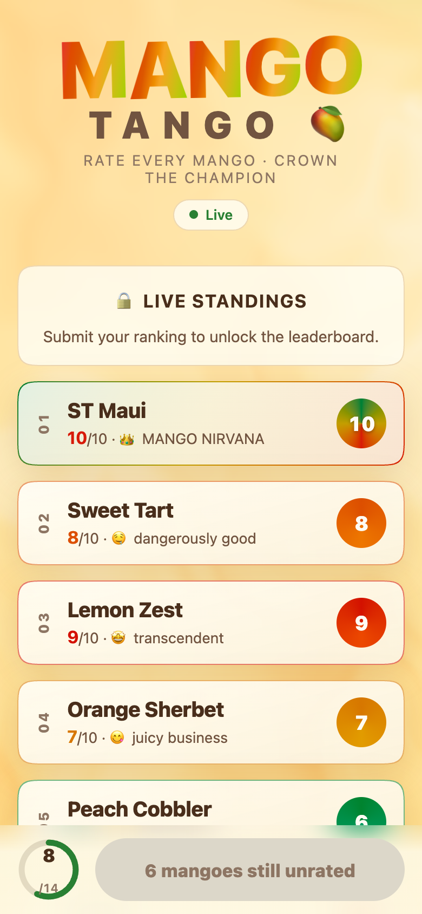
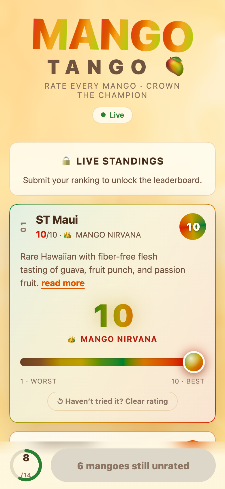
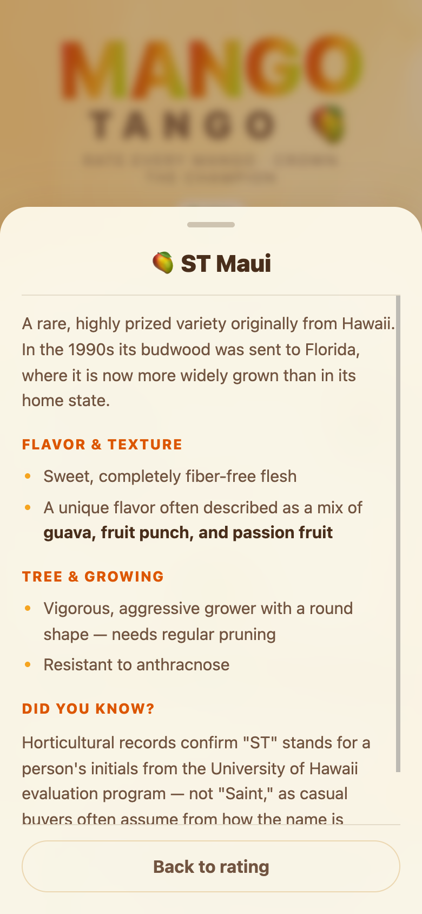
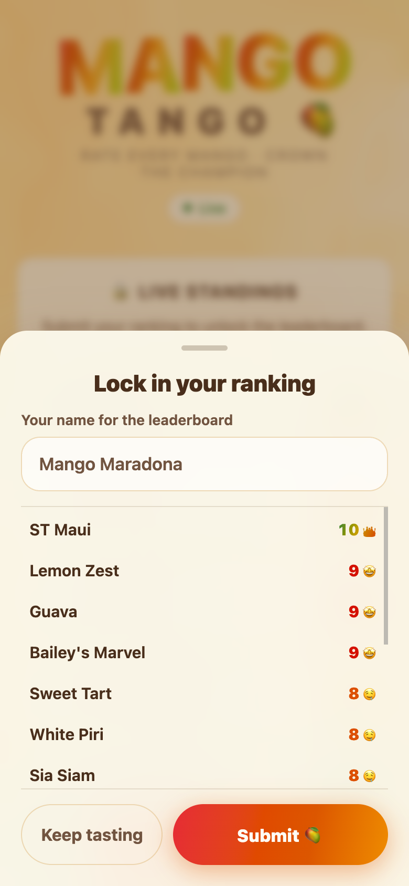
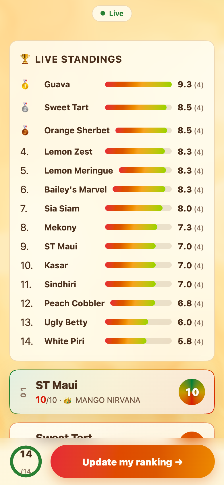
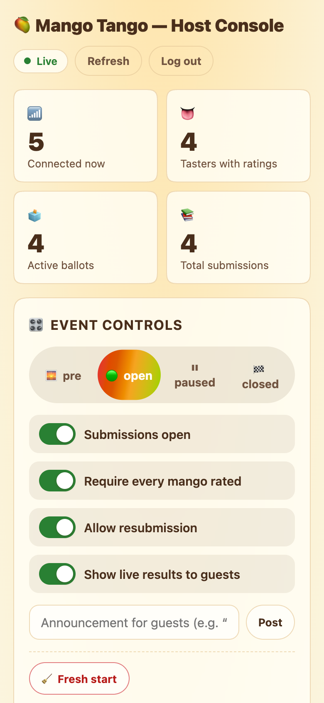

# 🥭 Mango Tango

Mobile-first realtime mango-ranking app for the annual Mango Tango event.
Guests rate mangoes 1–10 with no account; hosts run the show from a
password-protected console. One Cloudflare Worker + one SQLite-backed
Durable Object coordinate everything live.

## Screenshots

| Rate every mango | The whole-mango 10 | Read more |
| :---: | :---: | :---: |
|  |  |  |

| Lock it in | Live standings | Host console |
| :---: | :---: | :---: |
|  |  |  |

## Stack

- **Backend** — Cloudflare Worker routing `/api/*` to a single `MangoEvent`
  Durable Object (SQLite storage, WebSocket Hibernation API). Mutations go
  over HTTP (idempotent, stale-write-safe via per-client revisions); live
  updates fan out over WebSockets with an HTTP polling fallback.
- **Frontend** — Vite + `@cloudflare/vite-plugin`, Preact + signals.
  Guest app at `/`, host console at `/admin`. Zero external assets — no
  fonts, no CDNs — so it stays fast on party cellular.
- **Design** — WebGL "mango nectar" shader background (with CSS fallback +
  reduced-motion support), oklch palette, `linear()` spring easings,
  scroll-driven card entrances, squircle corners where supported, native
  `<dialog>` bottom sheet with `@starting-style` transitions, slider
  haptics, emoji confetti on submit.

## Develop

```sh
npm install
npm run dev        # Vite dev server with the Workers runtime + DO locally
```

Local admin password lives in `.dev.vars` (`ADMIN_PASSWORD=mango-dev-password`).
Open http://localhost:5173 (guest) and http://localhost:5173/admin (host).

```sh
npm run check      # typecheck app + worker
npm run build      # production build to dist/
```

## Deploy

```sh
npx wrangler login                        # once
npx wrangler secret put ADMIN_PASSWORD    # the host password
npm run deploy                            # vite build + wrangler deploy
```

Optionally set a separate cookie-signing secret:
`npx wrangler secret put SESSION_SECRET` (falls back to `ADMIN_PASSWORD`).

## How it fits together

- `src/worker/index.ts` — Worker entry: serves static assets, verifies the
  HMAC admin session cookie, forwards `/api/*` to the DO (internal
  `x-mt-admin` header is stripped from all inbound traffic).
- `src/worker/event-do.ts` — the event coordinator: schema, guest/admin
  snapshots, rating upserts (only newer `clientRev` wins), submission
  snapshots, results aggregation, rate limiting, audit log, WebSocket
  broadcast (full event+mango snapshot on every change; coalesced stats
  pushes to admins).
- `src/app/` — guest app: `store.ts` (signals), `net.ts` (WS reconnect +
  heartbeat, persisted autosave queue, polling fallback), `app.tsx` (UI),
  `shader.ts`, `confetti.ts`.
- `src/admin/` — host console (login, event controls, mango CRUD/reorder,
  live stats, results, CSV/JSON export, audit log).
- `shared/types.ts` — the protocol, shared by both sides.

The mango catalog lives in `shared/mangoes.json` (name, card summary, and
a long markdown description for the "read more" popup). First boot seeds
the event from it; to push catalog edits to an existing event, bump
`SEED_VERSION` in `src/worker/event-do.ts` — or just edit live from the
console.

## Notes

- A guest's identity is an anonymous `clientId` in localStorage; clearing
  browser data starts a fresh participant (by design, per scope).
- "Removing" a mango hides it; permanent delete is only allowed when it has
  no ratings. Submitted ballots snapshot mango names, so history survives
  list changes.
- Live standings (when enabled by the host) are only revealed to a guest
  after they submit their ranking — enforced server-side per client, so
  standings can't anchor scores that are still being decided. Until then
  guests see a "submit to unlock" teaser.
- Everything runs through one Durable Object (`idFromName('mango-tango')`),
  which serializes writes — no extra infrastructure needed.
